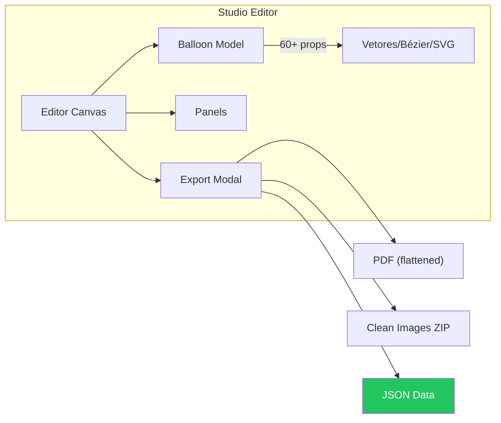
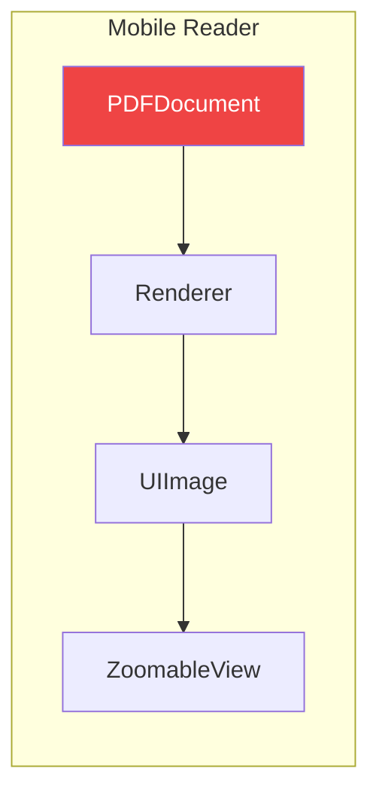
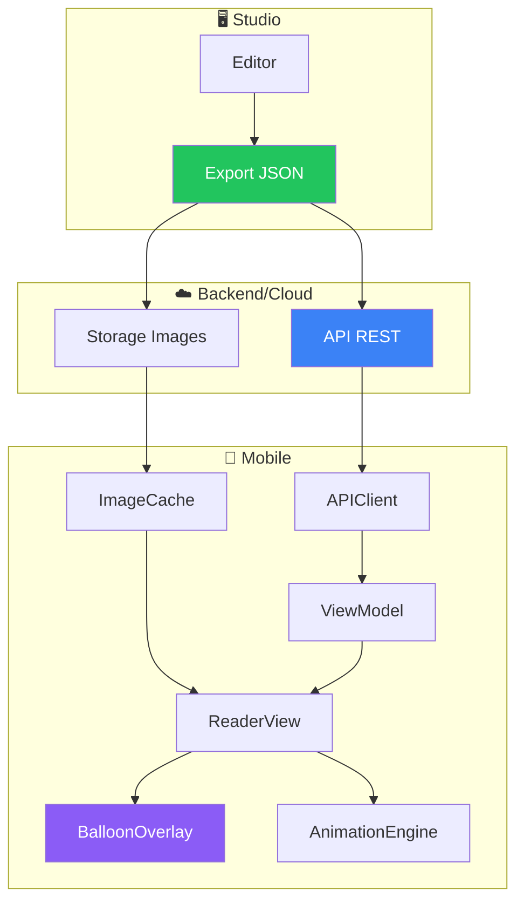

# Análise: Integração Mobile ↔ Studio

## TL;DR

Para o app iOS receber quadrinhos animados com balões vetorizados do Studio, você precisa implementar **4 camadas**:

1. **Modelos de Dados** (Swift Codable) para balões/painéis
2. **API de Sincronização** para baixar projetos do Studio  
3. **Engine de Renderização Vetorial** (Core Graphics ou SwiftUI Canvas)
4. **Sistema de Animações** coordenadas

---

## Estado Atual

### Studio App (Electron/React)



**Balloon Model (Studio)** - 60+ propriedades:
- `points[]`, `vertexHandles[]` → Geometria vetorial
- `curveControlPoints[]` → Curvas Bézier
- `customSvg`, `svgDataUrl` → SVG customizado
- `tailTip`, `tailControl`, `tailCurve` → Rabinho do balão
- `color`, `borderColor`, `opacity` → Estilos
- `rotation`, `scaleX`, `scaleY` → Transformações

---

### Mobile App (SwiftUI)



**Limitações Atuais:**
- `Comic.swift` só lê PDFs estáticos
- Renderiza páginas como `UIImage` (rasterizado)
- **Sem modelo para balões/painéis**
- **Sem API conectada ao Studio**

---

## O Que Precisa Ser Implementado

### Camada 1: Modelos de Dados

Criar structs Swift equivalentes aos tipos do Studio:

```swift
// Core/Models/Balloon.swift
struct Balloon: Codable, Identifiable {
    let id: String
    var text: String
    var box2d: [CGFloat]  // [ymin, xmin, ymax, xmax]
    var shape: BalloonShape
    var type: BalloonType
    
    // Geometria Vetorial
    var points: [CGPoint]?
    var vertexHandles: [VertexHandle]?
    
    // Estilo
    var color: String?
    var borderColor: String?
    var borderWidth: CGFloat?
    var opacity: CGFloat?
    
    // Tail (rabinho)
    var tailTip: CGPoint?
    var tailControl: CGPoint?
    
    // Transformação
    var rotation: CGFloat?
    var scaleX: CGFloat?
    var scaleY: CGFloat?
}

struct VertexHandle: Codable {
    var handleIn: CGPoint?
    var handleOut: CGPoint?
}

enum BalloonShape: String, Codable {
    case rectangle, ellipse, cloud, scream
}

enum BalloonType: String, Codable {
    case speech, thought, whisper, text, shape, mask
    case balloonSquare = "balloon-square"
    case balloonCircle = "balloon-circle"
    // ... etc
}

struct Panel: Codable, Identifiable {
    let id: String
    var order: Int
    var points: [CGFloat]
    var box2d: [CGFloat]
}

struct ComicPage: Codable {
    let imageUrl: String
    var balloons: [Balloon]
    var panels: [Panel]
}
```

---

### Camada 2: API de Sincronização

Expandir o `APIClient` para buscar projetos:

```swift
// Core/Network/StudioAPI.swift

struct StudioProject: Codable {
    let id: String
    let name: String
    let pages: [ComicPage]
}

extension APIClient {
    
    /// Fetch projects available for the user
    func getProjects() async throws -> [StudioProject] {
        try await get("/projects")
    }
    
    /// Download full project data with balloons
    func getProject(id: String) async throws -> StudioProject {
        try await get("/projects/\(id)")  
    }
    
    /// Download page images to local cache
    func downloadPageImage(url: String) async throws -> URL {
        // Download and cache locally
    }
}
```

**Backend necessário:** O Studio precisa expor uma API REST ou o JSON exportado precisa ser hostado.

---

### Camada 3: Engine de Renderização Vetorial

Duas abordagens possíveis:

#### Opção A: SwiftUI Canvas (Recomendado)

```swift
// Features/Reader/Views/BalloonOverlay.swift

struct BalloonOverlay: View {
    let balloon: Balloon
    let pageSize: CGSize
    
    var body: some View {
        Canvas { context, size in
            let path = buildPath(balloon: balloon, in: size)
            
            // Preencher
            context.fill(path, with: .color(Color(hex: balloon.color ?? "#FFFFFF")))
            
            // Borda
            context.stroke(path, with: .color(Color(hex: balloon.borderColor ?? "#000000")), 
                          lineWidth: balloon.borderWidth ?? 2)
        }
        .overlay {
            // Texto do balão
            Text(balloon.text)
                .font(.system(size: balloon.fontSize ?? 14))
                .foregroundColor(Color(hex: balloon.textColor ?? "#000000"))
        }
    }
    
    private func buildPath(balloon: Balloon, in size: CGSize) -> Path {
        var path = Path()
        
        guard let points = balloon.points, points.count > 0 else {
            // Fallback para shape simples
            return rectanglePath(balloon: balloon)
        }
        
        // Construir path com Bézier
        path.move(to: points[0])
        
        for i in 1..<points.count {
            if let handles = balloon.vertexHandles?[i-1] {
                // Curva Bézier cúbica
                path.addCurve(
                    to: points[i],
                    control1: handles.handleOut ?? points[i-1],
                    control2: handles.handleIn ?? points[i]
                )
            } else {
                // Linha reta
                path.addLine(to: points[i])
            }
        }
        
        path.closeSubpath()
        return path
    }
}
```

#### Opção B: Core Graphics (Mais performance)

```swift
class BalloonRenderer {
    static func render(balloon: Balloon, in context: CGContext, pageSize: CGSize) {
        context.saveGState()
        
        let path = CGMutablePath()
        // Similar ao SwiftUI Canvas, mas usando CGPath
        
        context.addPath(path)
        context.setFillColor(UIColor(hex: balloon.color ?? "#FFFFFF").cgColor)
        context.fillPath()
        
        context.restoreGState()
    }
}
```

---

### Camada 4: Sistema de Animações

Para animações coordenadas (ex: balões aparecendo em sequência):

```swift
// Features/Reader/ViewModels/AnimatedReaderViewModel.swift

struct BalloonAnimation {
    let balloonId: String
    let delay: TimeInterval
    let duration: TimeInterval
    let type: AnimationType
    
    enum AnimationType {
        case fadeIn, scaleIn, slideIn(from: Edge)
    }
}

class AnimatedReaderViewModel: ObservableObject {
    @Published var visibleBalloons: Set<String> = []
    
    func playPageAnimations(page: ComicPage) {
        // Reset
        visibleBalloons.removeAll()
        
        // Sequência
        for (index, balloon) in page.balloons.enumerated() {
            let delay = Double(index) * 0.3
            
            DispatchQueue.main.asyncAfter(deadline: .now() + delay) {
                withAnimation(.spring(response: 0.4, dampingFraction: 0.7)) {
                    self.visibleBalloons.insert(balloon.id)
                }
            }
        }
    }
}
```

---

## Arquitetura Final



---

## Esforço Estimado

| Componente | Complexidade | Tempo Estimado |
|------------|--------------|----------------|
| Modelos de Dados | Baixa | 2-3 horas |
| API Client Extensions | Média | 4-6 horas |
| Renderização Vetorial | **Alta** | 2-3 dias |
| Sistema de Animações | Média | 1 dia |
| Integração Reader | Média | 1 dia |
| **Total** | | **~5-6 dias** |

---

## Próximos Passos Recomendados

1. **Definir formato de exportação** - O Studio já exporta JSON, mas precisa de um schema padronizado
2. **Decidir backend** - Local (QR Code/AirDrop) ou Cloud (API)
3. **Implementar Balloon.swift** - Começar pelos modelos
4. **Prototipar BalloonOverlay** - Testar com dados mockados
5. **Conectar API** - Quando backend estiver pronto
